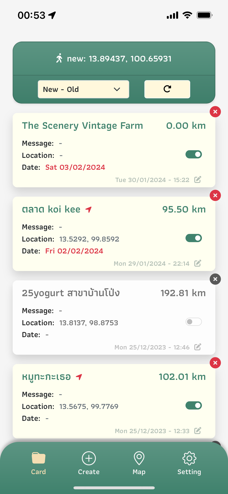
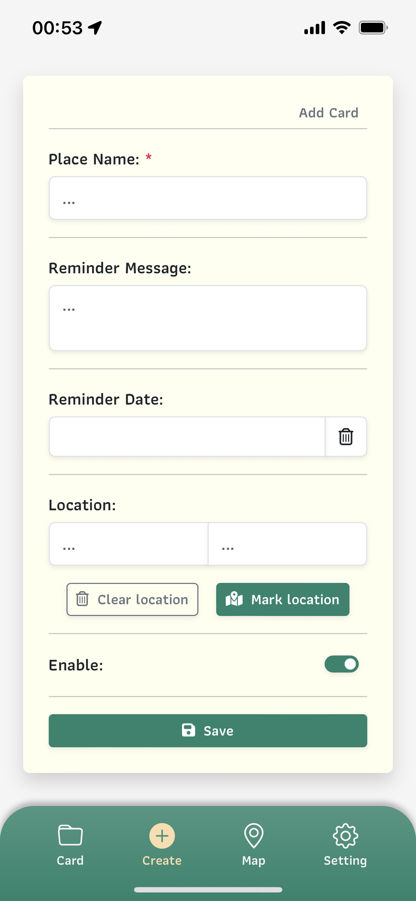
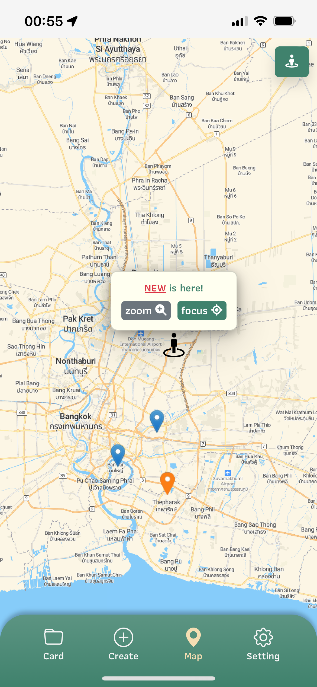
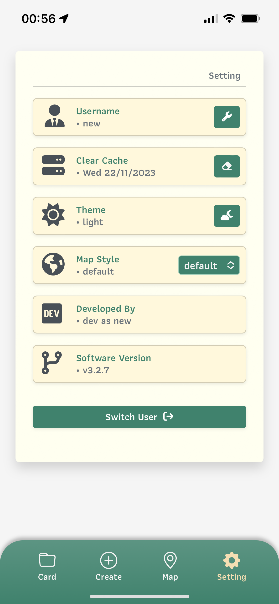
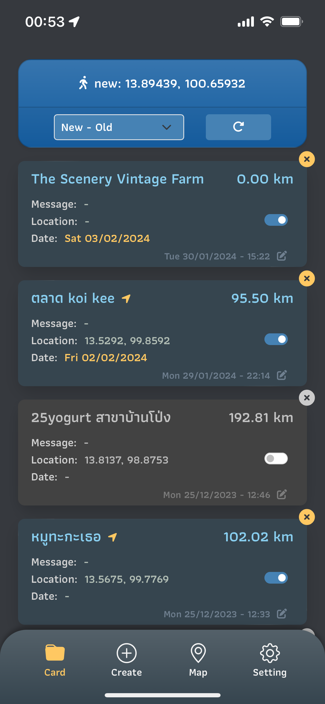
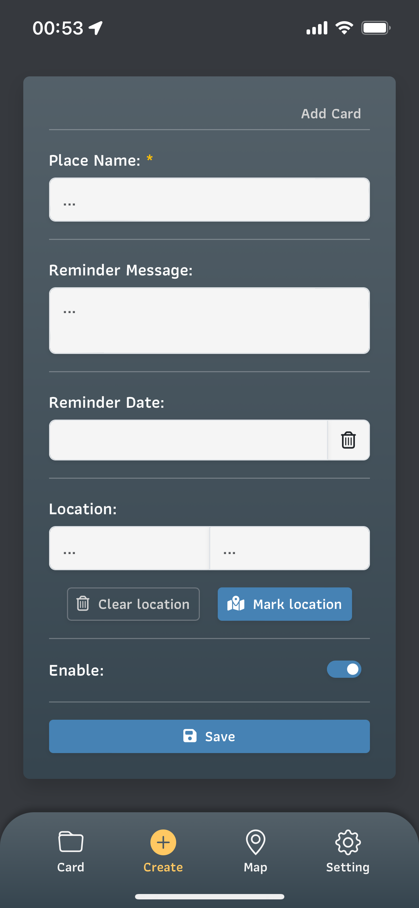
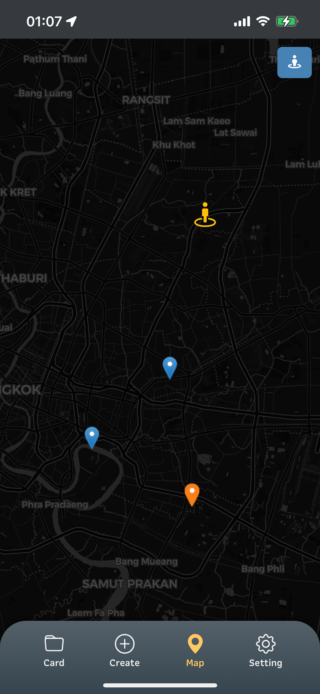
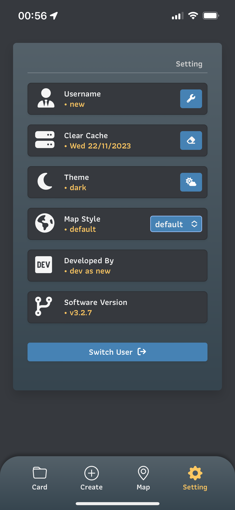

# Reminder Me Project 📍
Reminder me is place or location note taking app (pwa app) to remind user where to go.

# Sound Interesting ? 

Play demo in this link - https://reminder-me-chi.vercel.app/, You can register your account 😃 Thank you for playing.

## Light Theme 🌝
<div align="left">
  
  .
  
  .
  
  .
  
</div>

## Dark Theme 🌚
<div align="left">
  
  .
  
  .
  
  .
  
</div>

# Getting Started 

Develop for mobile first with PWA Technology, using [Next.js](https://nextjs.org/) project bootstrapped with [`create-next-app`](https://github.com/vercel/next.js/tree/canary/packages/create-next-app).

First, run the development server:

```bash
npm run dev
# or
yarn dev
# or
pnpm dev
```

Open [http://localhost:3000](http://localhost:3000) with your browser to see the result.
